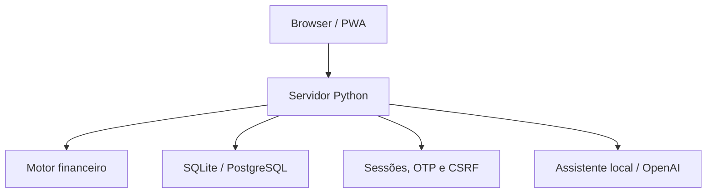

<h1 align="center">Aurea Finance</h1>

<p align="center">
  Planejamento financeiro pessoal com autenticação em duas etapas, motor de orçamento determinístico, histórico, PWA e assistente contextual.
</p>

<p align="center">
  <a href="https://aurea-finance.onrender.com"><strong>🚀 Testar demonstração</strong></a>
  ·
  <a href="ARCHITECTURE.md"><strong>Arquitetura</strong></a>
  ·
  <a href="ROADMAP.md"><strong>Roadmap</strong></a>
</p>

<p align="center">
  <a href="https://github.com/Juan01304/aurea-finance/actions/workflows/test.yml">
    
  </a>
  <a href="https://github.com/Juan01304/aurea-finance/actions/workflows/postgres.yml">
    
  </a>
</p>

<p align="center">
  
  
  
  
  
</p>

> A demonstração usa uma instância gratuita do Render e pode precisar ser ativada na primeira visita.

## O problema

A maioria dos controles financeiros responde **quanto você gastou**. A Aurea tenta responder uma pergunta mais imediata:

> **Quanto eu posso gastar agora sem comprometer contas e prioridades do mês?**

Ela combina renda, compromissos recorrentes, transações, metas e limites por categoria para calcular margem, reserva sugerida e um teto seguro de gasto.

## Experimente em poucos minutos

Acesse a [demonstração pública](https://aurea-finance.onrender.com) e selecione **Testar demonstração**. O ambiente abre com dados isolados para você explorar:

1. visão geral do orçamento;
2. contas, transações e limites;
3. metas e contribuições;
4. histórico dos últimos meses;
5. assistente contextual respondendo com base nos números do painel.

Nenhum cadastro é necessário no modo de demonstração.

## Funcionalidades

### Conta e segurança

- cadastro com confirmação de e-mail por OTP de 6 dígitos;
- login em duas etapas: senha + OTP;
- recuperação de senha por OTP;
- senhas com PBKDF2-HMAC-SHA256;
- OTP armazenado como HMAC, com expiração e limite de tentativas;
- sessão server-side, rotação após autenticação, CSRF e headers de segurança;
- rate limiting básico para fluxos sensíveis;
- exportação dos dados e exclusão da conta.

### Planejamento financeiro

- renda mensal, dia de pagamento e percentual desejado para reserva;
- contas fixas, cartão, assinaturas e dívidas;
- status pago/pendente preservado por mês;
- transações de entrada e saída;
- renda extra;
- limites por categoria;
- metas financeiras, contribuições e ritmo estimado até o prazo;
- indicador interno de Saúde do Orçamento;
- reserva sugerida adaptativa;
- teto seguro mensal e diário;
- histórico resumido de seis meses;
- exportação CSV e JSON.

### Assistente

- assistente local baseada nos números do painel, sem API paga;
- integração opcional com OpenAI Responses API;
- fallback automático para o modo local se a API externa falhar;
- IA nunca é a fonte de verdade dos cálculos financeiros.

### Experiência e infraestrutura

- interface responsiva e tema claro/escuro;
- PWA instalável;
- SQLite em desenvolvimento e PostgreSQL em produção;
- Docker e Render Blueprint;
- CI com testes SQLite, autenticação, exportação e PostgreSQL.

## Arquitetura



| Módulo | Responsabilidade |
|---|---|
| `aurea/finance.py` | Regras e cálculos financeiros |
| `aurea/db.py` | SQLite, PostgreSQL, schema e acesso a dados |
| `aurea/security.py` | Senhas, OTP, CSRF e identificadores seguros |
| `aurea/emailer.py` | Resend, SMTP e modo local |
| `aurea/ai.py` | Assistente local e integração opcional com OpenAI |
| `server.py` | Rotas HTTP e composição da aplicação |

Mais detalhes em [`ARCHITECTURE.md`](ARCHITECTURE.md).

## Decisões técnicas importantes

- **Cálculos determinísticos:** a IA explica os números, mas não define o orçamento.
- **Funciona sem serviços pagos:** o modo local cobre e-mail de desenvolvimento e assistente.
- **Duas bases compatíveis:** SQLite simplifica o ambiente local e PostgreSQL atende ao deploy.
- **Segurança em camadas:** senha, segundo fator, sessões server-side, CSRF, expiração e limite de tentativas.
- **Demonstração isolada:** o avaliador pode conhecer o produto sem criar conta.

## Executar localmente

### 1. Clone

```bash
git clone https://github.com/Juan01304/aurea-finance.git
cd aurea-finance
```

### 2. Ambiente virtual

```bash
python -m venv .venv
```

Windows:

```bash
.venv\Scripts\activate
```

Linux/macOS:

```bash
source .venv/bin/activate
```

### 3. Dependências

```bash
pip install -r requirements.txt
```

### 4. Configuração

Use `.env.example` como referência. Para o mínimo local:

```text
AUREA_SECRET=um-segredo-local
AUREA_HOST=127.0.0.1
AUREA_PORT=10000
```

### 5. Execute

```bash
python server.py
```

Abra `http://127.0.0.1:10000`. Sem Resend ou SMTP, os códigos OTP aparecem no terminal para facilitar o desenvolvimento.

## Integrações opcionais

### E-mail real com Resend

```text
RESEND_API_KEY=re_...
RESEND_FROM=Aurea Finance <acesso@seudominio.com>
```

Também há suporte a SMTP por meio das variáveis documentadas em `.env.example`.

### OpenAI

```text
OPENAI_API_KEY=...
OPENAI_MODEL=gpt-5.6-luna
```

Sem chave, a Aurea continua funcionando com a assistente local. A chave permanece somente no backend.

## Docker

```bash
docker build -t aurea-finance .
docker run --rm -p 10000:10000 -e AUREA_SECRET=local-secret aurea-finance
```

## Testes

```bash
python -m unittest discover -s tests -v
python -m py_compile server.py aurea/*.py
```

O CI também sobe a aplicação, testa cadastro, OTP, onboarding, exportação, demonstração e executa o caminho com PostgreSQL 16.

## Estrutura

```text
.
├── .github/workflows/      # CI SQLite, autenticação e PostgreSQL
├── aurea/                  # domínio, dados, segurança, e-mail e IA
├── public/                 # interface, PWA e páginas institucionais
├── tests/                  # testes unitários
├── ARCHITECTURE.md
├── SECURITY.md
├── ROADMAP.md
├── Dockerfile
├── render.yaml
└── server.py
```

## Status e limites

**Escopo de portfólio concluído.** O [roadmap](ROADMAP.md) separa o MVP atual do que ainda seria necessário para operar com usuários e dados importantes em escala real.

> Aurea é um projeto educacional/de portfólio. Não é banco, software financeiro auditado nem substituto de aconselhamento financeiro profissional.

## Licença

Distribuído sob a [licença MIT](LICENSE).
